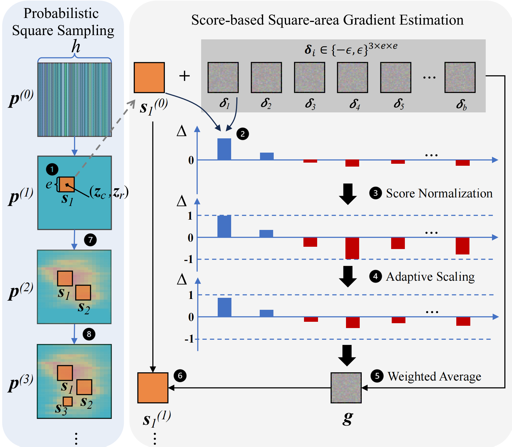

## What is Adversarial Patch Attack?

Vision Neural Networks have showcast promising capability of allowing computers to see. Among the study for the past decades, image classification is one of the most representative vison tasks that neworks are designed for. It is, for instance, given an input image $x$ of a cat, the neural network $f_c(x)$ distinguish this image and give the right decision of categarizing it as a cat. But in 2014, Szegedy et.al found that these Neural Networks are sensetive to the perturbation of the input image. Adding some particular perturbation which is hard to be perceived by humans to the input image would greatly disturb the jugement of the neural network, causing wrong output. After this, coming studies show that these perturbation can even lead the network output a pre-definded target output rather than just causing wrong output casually. Thus by adding appropriate perturbation into the input to trigger the vulnerability of these neuralnetworks is called adversarial attack while these disturbed inputs are called adversarial examples. 

The shape of the perturbation is non-trivial. It's common that the adversaral noise are the same size as the input image. But in this blog, we consider a variant that only covers a portion of the input image. This is adversarial patch attack and that portion of adversarial noise is called adversarial patch.

Note that while the vulnerability we discuss above was first discovered in vison tasks, recent studies find that this it is not confined in realm of vison but a general vulnerability lies in neural networks covering wide range of tasks e.g. text, speech and so on. In this post blog, we only talk about the adversarial attack in vison networks.

## Adversarial Attack Causing Error Beyond Wrong Image Classification

Image classification, as a relatively simple vison task, seems limited application. Thus, a bunch of neural networks are proposed for some more complicated pixel-wise regression tasks e.g. Depth Estimation and Optical Flow Estimation. <!-- These pixel-wise regression models input a image and outputs a score map with each pixel in input has corresponding score in score map.  -->Specificly, for depth estimation models, they input a image and output a depth map with each value in the depth map standing for the distance this pixel to the camera. For optical flow estimation models, they input a sequntial two frames of the scene and output a displacement map with each value in the map standing for the displacement between two frames. These two models are widely deployed to make self-driving possible with the depth model detecting the distance between surrouding objects and the car and optical flow model calculating the speed of moving objects.

Unfortunately, the above pixel-wise regression models are still exposed to the adversarial attacks. Adversarial **patch** attack even makes results unaffordable in real world circumstances. Let's think a scenario like this: a depth model embeded self-driving car is running on the road. The model runs on images captured by camera to sense the surrouding situation. As the model are sensitive to advervasiral noise, the attacker can craft a particular adversarial patch to make the depth of the patched area (error can permeate beyoud this area actually) far than it actually is. The attacker can print this adversarial patch and paste it on a barrier along the road. Once the camera captures this adversarial patch, the car can wrongly estimate the distance between itself and the front barrier, thinking they are far from each other but close instead. The consequence is obvious —— crashing into the barrier. 

Some examples are shown in the figure, the adversarial patches cause significant estimation error both in depth and optical flow. (Adversarial patches are optimized by BardPart)

## Adversarial Patch Optimization

Not all noise can be effective for triggering the vulnerability. It must have some particular pattern and distribution that the target neural network is sensitive to. So, the qestion is how to find that particular distribution?

Before figuring out this question, let's take a look at what capabilities you have.

### Threat model

Taking what capabilities the attacker can possess, the attack can be divided into two catageries: white-box and black-box attack. 

1. In white-box attack scenario, the assumption is that the attacker have access to the whole target neural network. Thus the adversarial patch can be optimized by gradient descent because the gradients are available. 

2. In black-box scenario, the target neural network are transparent to the attacker. The attacker can only feed the model an input and get the corresponding feedback to adjust his adversarial patch.

Although white-box method can achive superior attack performance compared with black-box attacks, the assumption of accessibility of target model is too strong to fulfill in real situations. In contrary, the black-box setting is realistic that many widely applyed commercial networks are closed source and only provides services (i.e. taking the input and give the output, gradients are also not available). Thus great danger will be caused if attack can be launched under this black-box setting which means these widely used commercial networks are vulnerable to attackers.

### BadPart

There exist some popular score based methods and decision based methods which are proposed for optimizing adversarial noise for classification models. But most of them are based on the attributes of classification task itself which are not adaptable for pixel-wise tasks. However, some ideas behind these methods seem adaptive to the pixel-wise models. For score based methods, the most representitive one is random search. It is a iterative optimization which works by randomly generating a adversarial patch and feed it into the model to get the feedback score in every iteration. The final saved best adversarial patch will be the one that has the highest score across the process. Some other methods follow the similar procedure but with the difference of generating new adversarial patch by heuristic algorithm (e.g. genetic algorithm). Although these methods may behave well in attacking classification models, they are limited for pixel-wise regression models for two reasons:

1. The patch area is relatively bigger than that in classification attack, resulting in much larger search space.

2. Random search does not utilize the feedback information well, resulting in taking many nonsense attempts.

Given the above confinements, we propose the first black-box adversarial patch attack framework against pixel-wise regression models:

> BadPart: Unified Black-box Adversarial Patch Attacks against Pixel-wise Regression Tasks.

By our method, we show the possibility that the attacker can successfully launch an adversarial patch attack towards pixel-wise task models. BadPart novelly employs probabilistic square sampling and score-based gradient estimation techniques to generate adversarial patch. The method overview is presented below. More details of our algorithm can be found in our [paper](https://arxiv.org/abs/2404.00924) and code is available in our [github](https://github.com/Bob-cheng/BadPart).

## Ethics
More and more advanced SOTA models have been developed by researchers. But their robustness to such adverarial attack is not fully considered. Our work highlights potential security risks in applications that rely on those models, such as autonomous driving, virtual reality and video compositions. We hope to draw attention of related developers, and motivate the machine learning (ML) community to create more robust models or defense mechanisms against these types of attacks avoiding leading to real accidents.